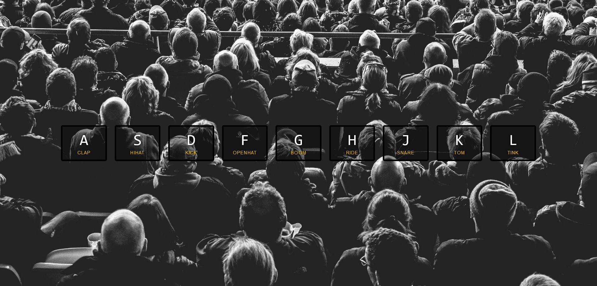

<h1 align="center">Drum Kit</h1>

This is a solution to the [Drum Kit JavaScript-30 Challenge](https://javascript30.com/).

### Screenshot

### I learned

- <b>transitionend</b> event
- <b>currentTime</b> audio property
